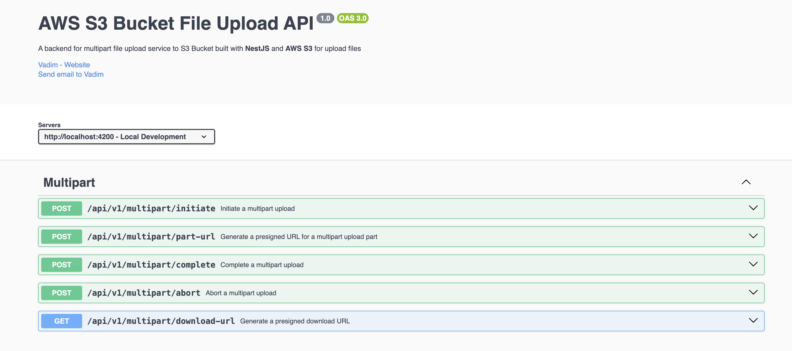
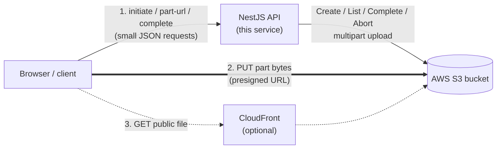
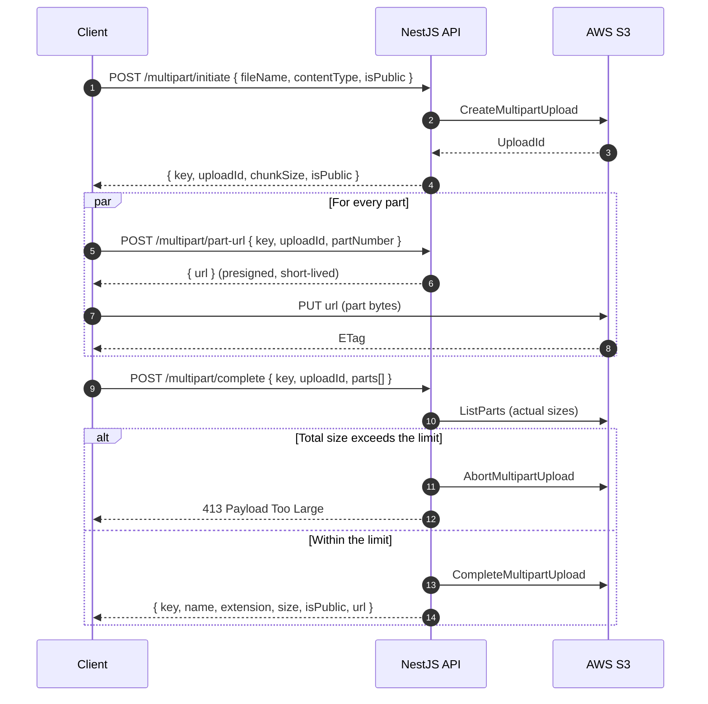
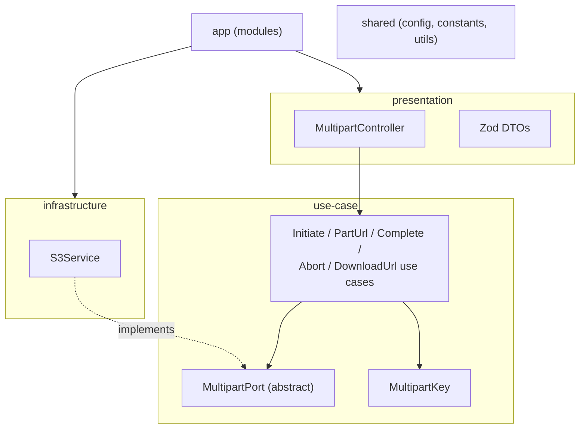

<div align="center">

# AWS S3 Multipart Upload API

**Direct-to-S3 uploads for large files, built with NestJS.**

The API orchestrates S3 multipart uploads and signs short-lived URLs.
File bytes travel from the browser straight to S3 and never touch the server.

[](https://nestjs.com)
[](https://www.typescriptlang.org)
[](https://bun.sh)
[](https://aws.amazon.com/s3/)
[](https://zod.dev)
[](#api-reference)

</div>



## Frontend Repository

[Github Repository](https://github.com/thekinv21/AWS_MultipartFileUpload_FE)

## Overview

Uploading large files through an application server is slow and expensive: every byte is received, buffered and forwarded again, and a single dropped connection means starting over. This service removes the server from the data path.

|                               | Proxy upload (classic)      | This API (direct to S3)                                        |
| ----------------------------- | --------------------------- | -------------------------------------------------------------- |
| File bytes through the server | All of them                 | None                                                           |
| Server memory and bandwidth   | Grows with file size        | Constant, a few small JSON requests                            |
| Resume after a failed part    | Restart the whole file      | Retry only that part                                           |
| Parallelism                   | Limited by one request      | Many parts at once                                             |
| Maximum file size             | Limited by request timeouts | Up to the configured limit (1 GiB by default, S3 allows 5 TiB) |

The API is stateless and has no database. Everything it needs about a file (name, extension, visibility) is encoded in the object key, so the service scales horizontally without coordination.

## Highlights

**Uploads**

- S3 multipart upload with a configurable part size (5 MiB by default) and part count (1 000 by default, up to S3's limit of 10 000).
- Parts can be uploaded in parallel and in any order; the server sorts them on completion.
- The final size is calculated from the parts actually stored in S3, not from what the client claims. Uploads over the limit are aborted automatically.

**Access control**

- Every file is either **public** (permanent URL) or **private** (time-limited download link).
- Visibility is chosen at initiation and is part of the server-generated key, so the client cannot change it later.
- Download links make the browser save the file under its original name.

**Validation and developer experience**

- All input is validated at the boundary with Zod (`nestjs-zod`); errors share one consistent `400` shape.
- File extension and MIME type are checked together against an allowlist.
- Swagger / OpenAPI documentation is generated from the same Zod schemas, so docs and validation never drift apart.
- Environment variables are validated on startup; a misconfigured instance refuses to boot and explains why.

## Architecture

### System overview



### Upload sequence



If a part fails permanently or the user cancels, the client calls `POST /multipart/abort` and S3 discards the uploaded parts.

### Application layers

The codebase follows a ports and adapters style with five layers. Business logic depends on an abstract `MultipartPort`, never on the AWS SDK directly:



Swapping S3 for another S3-compatible store (MinIO, Cloudflare R2) means writing a new `MultipartPort` implementation; no use case changes.

## Quick start

### Prerequisites

- [Bun](https://bun.sh) 1.x
- An AWS account with an S3 bucket and an IAM user for the API (see [AWS setup](#aws-setup))

### Install and run

```bash
bun install
cp .env.example .env    # then fill in the AWS values
bun run start:dev
```

| URL                                      | Description                                      |
| ---------------------------------------- | ------------------------------------------------ |
| `http://localhost:4200/api/v1/multipart` | API base URL                                     |
| `http://localhost:4200/docs`             | Swagger UI (disabled when `NODE_ENV=production`) |

## Configuration

All variables are validated on startup with Zod. See [`.env.example`](.env.example) for a template.

### Application

| Variable       | Required | Default in example      | Description                                                               |
| -------------- | :------: | ----------------------- | ------------------------------------------------------------------------- |
| `NODE_ENV`     |    ✓     | `development`           | `development`, `production` or `test`. Swagger is disabled in production. |
| `PORT`         |    ✓     | `4200`                  | HTTP port.                                                                |
| `CORS_ORIGINS` |    ✓     | `http://localhost:3000` | Comma-separated list of origins allowed to call the API.                  |

### AWS

| Variable                       | Required | Default in example | Description                                                                                                         |
| ------------------------------ | :------: | ------------------ | ------------------------------------------------------------------------------------------------------------------- |
| `AWS_BUCKET_NAME`              |    ✓     |                    | Target bucket.                                                                                                      |
| `AWS_S3_REGION`                |    ✓     |                    | Bucket region, e.g. `eu-central-1`.                                                                                 |
| `AWS_ACCESS_KEY_ID`            |    ✓     |                    | Access key of the API's IAM user.                                                                                   |
| `AWS_SECRET_ACCESS_KEY`        |    ✓     |                    | Secret key of the API's IAM user.                                                                                   |
| `AWS_PUBLIC_BASE_URL`          |          |                    | Base URL for public file links, e.g. a CloudFront domain. Defaults to `https://<bucket>.s3.<region>.amazonaws.com`. |
| `AWS_UPLOAD_KEY_PREFIX`        |    ✓     | `uploads/`         | Root folder for all uploads. Must end with `/`.                                                                     |
| `AWS_PRESIGNED_URL_EXPIRES_IN` |    ✓     | `1200`             | Presigned URL lifetime in seconds (max `604800`).                                                                   |

### Upload limits

| Variable                   | Required | Default in example | Description                                                |
| -------------------------- | :------: | ------------------ | ---------------------------------------------------------- |
| `AWS_FILE_MAX_SIZE_BYTES`  |    ✓     | `1073741824`       | Maximum size of one file (1 GiB).                          |
| `AWS_FILE_MAX_NAME_LENGTH` |    ✓     | `255`              | Maximum file name length.                                  |
| `AWS_FILE_CHUNK_SIZE`      |    ✓     | `5242880`          | Part size returned to clients. S3 requires at least 5 MiB. |
| `AWS_FILE_MIN_PART_NUMBER` |    ✓     | `1`                | Lowest accepted part number.                               |
| `AWS_FILE_MAX_PART_NUMBER` |    ✓     | `1000`             | Highest accepted part number (S3 allows up to `10000`).    |

Cross-field rules are enforced as well: `AWS_FILE_MIN_PART_NUMBER ≤ AWS_FILE_MAX_PART_NUMBER`, and `AWS_FILE_MAX_SIZE_BYTES ≤ AWS_FILE_CHUNK_SIZE × AWS_FILE_MAX_PART_NUMBER` so the largest allowed file always fits in the allowed number of parts.

> [!NOTE]
> Keep the frontend limits (`NEXT_PUBLIC_FILE_MAX_SIZE_BYTES`, `NEXT_PUBLIC_FILE_MAX_NAME_LENGTH`) in sync with these values. The frontend check is for user experience only; this API enforces the real limits.

## AWS setup

### 1. IAM policy for the API

Create a dedicated IAM user (or role) for the API with the minimum permissions below. Presigned URLs carry the signer's permissions, so this policy is also the upper bound of what any client can do.

```json
{
  "Version": "2012-10-17",
  "Statement": [
    {
      "Sid": "MultipartUploads",
      "Effect": "Allow",
      "Action": [
        "s3:PutObject",
        "s3:GetObject",
        "s3:AbortMultipartUpload",
        "s3:ListMultipartUploadParts"
      ],
      "Resource": "arn:aws:s3:::<BUCKET_NAME>/uploads/*"
    }
  ]
}
```

| Permission                    | Used for                                                                   |
| ----------------------------- | -------------------------------------------------------------------------- |
| `s3:PutObject`                | `CreateMultipartUpload`, presigned `UploadPart`, `CompleteMultipartUpload` |
| `s3:ListMultipartUploadParts` | Reading actual part sizes before completing                                |
| `s3:AbortMultipartUpload`     | Client cancellation and size limit enforcement                             |
| `s3:GetObject`                | Presigned downloads and the existence check (`HeadObject`)                 |

### 2. Bucket CORS

Browsers upload parts directly to S3, so the bucket must allow the frontend origin and **expose the `ETag` header**. Without it the client cannot read part ETags and completion fails.

```json
[
  {
    "AllowedOrigins": ["http://localhost:3000"],
    "AllowedMethods": ["GET", "PUT", "HEAD"],
    "AllowedHeaders": ["*"],
    "ExposeHeaders": ["ETag"],
    "MaxAgeSeconds": 3000
  }
]
```

### 3. Lifecycle rule for abandoned uploads

Uploads interrupted by a closed tab or lost connection are neither completed nor aborted. Their parts are invisible in the console but still billed. Add a lifecycle rule under **Bucket → Management → Create lifecycle rule**:

| Setting                                   | Value                                                                |
| ----------------------------------------- | -------------------------------------------------------------------- |
| Prefix                                    | `uploads/`                                                           |
| Action                                    | Delete expired object delete markers or incomplete multipart uploads |
| Delete incomplete multipart uploads after | `1` day                                                              |

### 4. Serving public files

Public files need read access on `uploads/public/*`. Choose one of the following.

<details open>
<summary><b>Option A — CloudFront with Origin Access Control (recommended)</b></summary>

<br/>

The bucket stays fully private and all four Block Public Access settings remain **on**. CloudFront is the only principal allowed to read the public folder.

1. Create a CloudFront distribution with the bucket as origin and select **Origin access control settings**.
2. Apply this bucket policy:

   ```json
   {
     "Version": "2012-10-17",
     "Statement": [
       {
         "Sid": "CloudFrontReadPublicFolder",
         "Effect": "Allow",
         "Principal": { "Service": "cloudfront.amazonaws.com" },
         "Action": "s3:GetObject",
         "Resource": "arn:aws:s3:::<BUCKET_NAME>/uploads/public/*",
         "Condition": {
           "StringEquals": {
             "AWS:SourceArn": "arn:aws:cloudfront::<ACCOUNT_ID>:distribution/<DISTRIBUTION_ID>"
           }
         }
       }
     ]
   }
   ```

3. Set `AWS_PUBLIC_BASE_URL=https://<distribution>.cloudfront.net`.

You also get edge caching, links that are independent of the bucket, optional WAF rate limiting, and response header policies such as `X-Content-Type-Options: nosniff`.

</details>

<details>
<summary><b>Option B — Public bucket policy</b></summary>

<br/>

Simpler to set up, but the bucket itself becomes publicly readable for that prefix.

1. In **both** the account-level and bucket-level _Block Public Access_ settings, turn off the two **policy** settings and keep the two **ACL** settings on.
2. Apply this bucket policy:

   ```json
   {
     "Version": "2012-10-17",
     "Statement": [
       {
         "Sid": "PublicReadForPublicFolder",
         "Effect": "Allow",
         "Principal": "*",
         "Action": "s3:GetObject",
         "Resource": "arn:aws:s3:::<BUCKET_NAME>/uploads/public/*"
       }
     ]
   }
   ```

If saving fails with _"public policies are prevented by the BlockPublicPolicy setting"_, one of the policy settings (usually the account-level one) is still on.

</details>

> [!IMPORTANT]
> The `uploads/` segment in every policy must match `AWS_UPLOAD_KEY_PREFIX`. Update the policies whenever you change the prefix.

## API reference

Base path: `/api/v1/multipart`. All bodies are JSON. Interactive documentation is available at [`/docs`](http://localhost:4200/docs).

| Method | Endpoint                             | Purpose                                | Success |
| ------ | ------------------------------------ | -------------------------------------- | ------- |
| `POST` | [`/initiate`](#post-initiate)        | Start a multipart upload               | `201`   |
| `POST` | [`/part-url`](#post-part-url)        | Presigned URL for one part             | `201`   |
| `POST` | [`/complete`](#post-complete)        | Assemble the parts into the final file | `201`   |
| `POST` | [`/abort`](#post-abort)              | Cancel and discard the parts           | `204`   |
| `GET`  | [`/download-url`](#get-download-url) | Time-limited download link             | `200`   |

<a id="post-initiate"></a>

### `POST /initiate`

Starts a multipart upload and returns the identifiers for the next steps.

**Request**

```json
{
  "fileName": "Report 2026.pdf",
  "contentType": "application/pdf",
  "isPublic": false
}
```

| Field         | Type      | Required | Rules                                                                                            |
| ------------- | --------- | :------: | ------------------------------------------------------------------------------------------------ |
| `fileName`    | `string`  |    ✓     | 1 to `AWS_FILE_MAX_NAME_LENGTH` characters; no `/`, `\` or control characters; allowed extension |
| `contentType` | `string`  |    ✓     | Must match the extension, e.g. `.pdf` → `application/pdf`                                        |
| `isPublic`    | `boolean` |          | Defaults to `false`                                                                              |

**Response `201`**

```json
{
  "key": "uploads/private/0f6c2f0e-6c1a-4f43-9d3f-2b1f0c5e9a77-Report 2026.pdf",
  "uploadId": "VXBsb2FkIElEIGZvciA...",
  "chunkSize": 5242880,
  "isPublic": false
}
```

Split the file into parts of `chunkSize` bytes (the last part may be smaller).

<details>
<summary>Allowed file types</summary>

<br/>

| Extension     | MIME types                                                                |
| ------------- | ------------------------------------------------------------------------- |
| `pdf`         | `application/pdf`                                                         |
| `doc`         | `application/msword`                                                      |
| `docx`        | `application/vnd.openxmlformats-officedocument.wordprocessingml.document` |
| `txt`         | `text/plain`                                                              |
| `xls`         | `application/vnd.ms-excel`                                                |
| `xlsx`        | `application/vnd.openxmlformats-officedocument.spreadsheetml.sheet`       |
| `csv`         | `text/csv`, `application/vnd.ms-excel`                                    |
| `jpg`, `jpeg` | `image/jpeg`                                                              |
| `png`         | `image/png`                                                               |
| `webp`        | `image/webp`                                                              |
| `gif`         | `image/gif`                                                               |
| `bmp`         | `image/bmp`                                                               |
| `ico`         | `image/x-icon`, `image/vnd.microsoft.icon`                                |

The list lives in [`src/shared/constants/FileConstant.ts`](src/shared/constants/FileConstant.ts).

</details>

<a id="post-part-url"></a>

### `POST /part-url`

Returns a presigned URL for uploading one part directly to S3.

**Request**

```json
{
  "key": "uploads/private/0f6c2f0e-...-Report 2026.pdf",
  "uploadId": "VXBsb2FkIElEIGZvciA...",
  "partNumber": 1
}
```

**Response `201`**

```json
{
  "url": "https://<bucket>.s3.<region>.amazonaws.com/uploads/private/...?X-Amz-Signature=..."
}
```

`PUT` the raw part bytes to `url` and keep the `ETag` response header for completion. The URL expires after `AWS_PRESIGNED_URL_EXPIRES_IN` seconds.

<a id="post-complete"></a>

### `POST /complete`

Verifies the total size and assembles the parts into the final object.

**Request**

```json
{
  "key": "uploads/private/0f6c2f0e-...-Report 2026.pdf",
  "uploadId": "VXBsb2FkIElEIGZvciA...",
  "parts": [
    { "PartNumber": 1, "ETag": "\"5d41402abc4b2a76b9719d911017c592\"" },
    { "PartNumber": 2, "ETag": "\"7d793037a0760186574b0282f2f435e7\"" }
  ]
}
```

Parts may be listed in any order; `PartNumber` values must be unique.

**Response `201`**

```json
{
  "key": "uploads/private/0f6c2f0e-...-Report 2026.pdf",
  "name": "Report 2026.pdf",
  "extension": "pdf",
  "size": 6291864,
  "isPublic": false,
  "url": null
}
```

| Field       | Description                                               |
| ----------- | --------------------------------------------------------- |
| `key`       | Object key in S3; use it to request download links.       |
| `name`      | Original file name, without the UUID prefix.              |
| `extension` | Lowercase extension without the dot.                      |
| `size`      | Actual size in bytes, as stored in S3.                    |
| `isPublic`  | Visibility of the file.                                   |
| `url`       | Permanent URL for public files; `null` for private files. |

The API does not persist this response. Store it in your own system if you need to list or reference uploaded files later.

<a id="post-abort"></a>

### `POST /abort`

Cancels an upload and discards all uploaded parts.

**Request** — `{ "key": "...", "uploadId": "..." }`
**Response** — `204 No Content`

The call is idempotent: aborting an already aborted upload also returns `204`.

<a id="get-download-url"></a>

### `GET /download-url`

Returns a time-limited link that downloads the file under its original name (`Content-Disposition: attachment`). Works for both public and private files.

**Request** — `GET /api/v1/multipart/download-url?key=uploads/private/0f6c2f0e-...-Report%202026.pdf`

**Response `200`**

```json
{
  "url": "https://<bucket>.s3.<region>.amazonaws.com/uploads/private/...?response-content-disposition=..."
}
```

### Errors

Validation errors share a single shape:

```json
{
  "statusCode": 400,
  "message": "Validation failed",
  "errors": [
    {
      "code": "custom",
      "path": ["key"],
      "message": "key must be directly under uploads/public/ or uploads/private/"
    }
  ]
}
```

| Status                      | Meaning                                                                                                                                                                   |
| --------------------------- | ------------------------------------------------------------------------------------------------------------------------------------------------------------------------- |
| `400 Bad Request`           | Invalid body or query, disallowed file type, extension and `contentType` mismatch, invalid key, or a rejected part (`InvalidPart`, `InvalidPartOrder`, `EntityTooSmall`). |
| `404 Not Found`             | Unknown `uploadId` (already completed, aborted or never created), or the requested file does not exist.                                                                   |
| `413 Payload Too Large`     | The uploaded parts exceed `AWS_FILE_MAX_SIZE_BYTES`; the upload has been aborted.                                                                                         |
| `500 Internal Server Error` | Unexpected S3 or server failure. Details are logged, not returned.                                                                                                        |

## Security model

| Concern                 | How it is handled                                                                                                                                                                                           |
| ----------------------- | ----------------------------------------------------------------------------------------------------------------------------------------------------------------------------------------------------------- |
| **Key ownership**       | Keys are generated by the server as `<prefix><public\|private>/<uuid>-<fileName>`. S3 binds each `uploadId` to its key, so a client cannot redirect an upload to another location or change its visibility. |
| **Path traversal**      | Every incoming `key` must sit directly under `<prefix>public/` or `<prefix>private/`. Nested paths and `..` segments are rejected with `400`.                                                               |
| **Guessable links**     | A random UUID in every key makes public URLs unguessable without the exact link.                                                                                                                            |
| **Oversized uploads**   | The size limit is enforced on completion using S3's own part sizes; the client cannot underreport.                                                                                                          |
| **File types**          | Extension and declared MIME type must both match the allowlist.                                                                                                                                             |
| **Credential exposure** | AWS credentials stay on the server. Clients only receive presigned URLs scoped to one operation and object, valid for `AWS_PRESIGNED_URL_EXPIRES_IN` seconds.                                               |
| **Transport headers**   | `helmet` sets secure HTTP headers; CORS is restricted to `CORS_ORIGINS`.                                                                                                                                    |
| **Error leakage**       | Unexpected errors are logged server-side and returned as a generic `500`.                                                                                                                                   |

## Project structure

```
src/
├── app/                        # Nest modules: wiring only
│   ├── AppModule.ts
│   └── MultipartModule.ts
├── infrastructure/             # Adapters to external systems
│   ├── config/swagger/         # OpenAPI document setup
│   └── storage/                # S3Client factory and S3Service (MultipartPort adapter)
├── presentation/               # HTTP boundary
│   ├── controller/             # MultipartController
│   └── dto/multipart/          # Zod request and response DTOs
├── shared/                     # Cross-cutting code
│   ├── config/                 # Env schema and startup validation
│   ├── constants/              # Limits and allowed file types
│   ├── types/
│   └── utils/
├── use-case/                   # Business logic
│   └── multipart/
│       ├── port/               # MultipartPort (storage abstraction)
│       ├── types/
│       ├── MultipartKey.ts     # Builds and parses object keys
│       └── *UseCase.ts         # One class per operation
└── main.ts                     # Bootstrap: helmet, CORS, versioning, Swagger
```

| Layer            | Responsibility                      | May depend on        |
| ---------------- | ----------------------------------- | -------------------- |
| `shared`         | Configuration, constants, utilities | —                    |
| `use-case`       | Business rules, storage port        | `shared`             |
| `infrastructure` | AWS SDK integration                 | `use-case`, `shared` |
| `presentation`   | Controllers, DTOs, validation       | `use-case`, `shared` |
| `app`            | Module composition                  | all layers           |

## Scripts

| Command                | Description                      |
| ---------------------- | -------------------------------- |
| `bun run start:dev`    | Start in watch mode              |
| `bun run start`        | Start once                       |
| `bun run start:debug`  | Start with the debugger attached |
| `bun run build`        | Compile to `dist/`               |
| `bun run start:prod`   | Run the compiled build           |
| `bun run lint`         | Type-aware linting with oxlint   |
| `bun run format`       | Format sources with Prettier     |
| `bun run format:check` | Verify formatting                |
